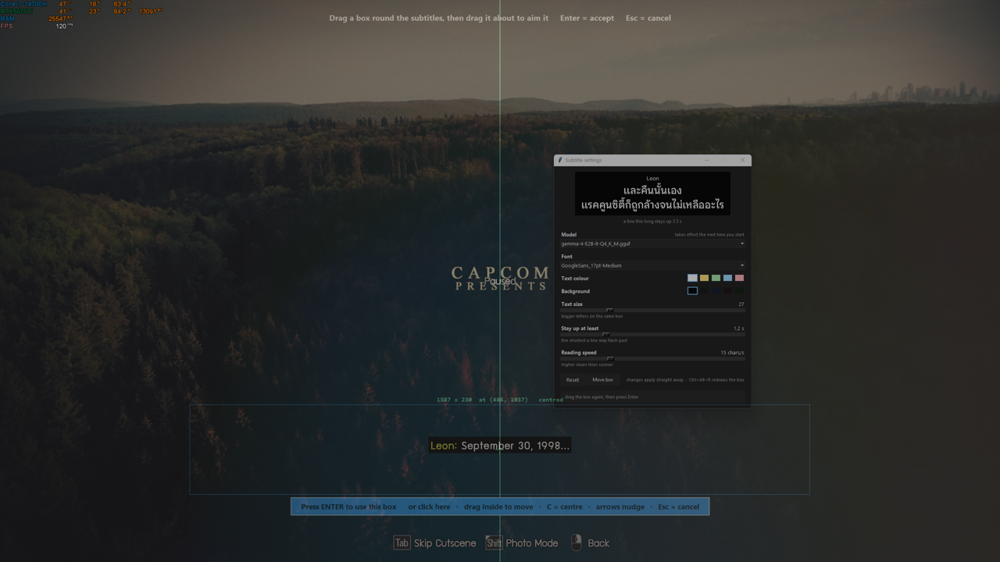
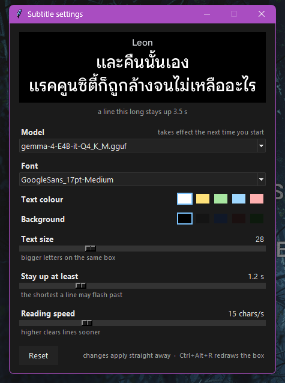
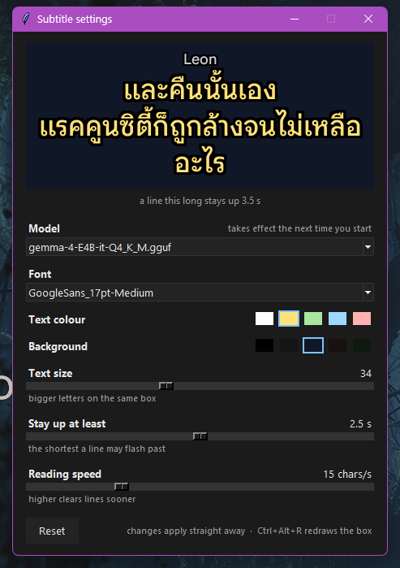

# Guide — from downloading this to Thai subtitles on your game

Five minutes, four screens, and two keys to remember. Nothing here needs the command line.

The rest of the [README](README.md) is about how it works and how it was measured. This page is
only about using it.

---

## 1. Get it running — double-click `play.bat`

Download the ZIP from the top of the repo page, unzip it, and double-click **`play.bat`**.

The first run tells you what it needs and waits:

```
  This is the first run, so there are two things to fetch before anything can start:

    llama.cpp   the program that runs the model             about 34 MB
    the model   what reads your screen and translates       about 5.9 GB

  Press ENTER to fetch them now, or type N and press ENTER to cancel:
```

Press Enter and it fetches both, then starts. **Every run after that starts immediately.**
The download resumes if you stop it, and everything lands inside that one folder —
uninstalling is deleting the folder.

You need **Python 3.8 or newer**, installed with *Add Python to PATH* ticked. If it is
missing, the first run says so and links you to the download.

> `setup.bat` still exists if you would rather fetch everything ahead of time. It is no
> longer a step you have to know about.

---

## 2. Start it — double-click `play.bat`

A settings window opens. **Everything you have to decide is on it**, and nothing happens
until you press **Start**.


| | |
|---|---|
| **Model** | which weights read the screen — only worth touching if you have more than one in the `models` folder |
| **Font** | every font on the machine that can actually draw your language, plus anything you dropped in `fonts` |
| **Text colour**, **Background** | white on black is what games use; yellow reads better for some people |
| **Text size** | bigger letters |
| **Stay up at least**, **Reading speed** | how long a line is on screen — see section 7 |

Press **Start** and the model begins loading while you aim the box, so the minute it takes
goes into something you were doing anyway. The strip along the bottom of the window says
which stage it is on.

**Leave the window open while you play.** Every control on it reaches the subtitle straight
away — a subtitle setting is not something anyone can judge without watching one.

## 3. Choose a font

The **Font** dropdown lists every font on the machine that can draw your language, with the
ones in the repo's own `fonts` folder first. The preview above it is drawn by the same code
that draws the real subtitles, so what you see there is what you will get.

**Look at the marks above the letters.** The sample is the hard case on purpose: `ซื้อ`
needs a vowel *and* a tone mark stacked on one consonant. A font that cannot do it draws
`ซือ` — a different word, drawn confidently, with nothing reporting a problem.

Want a font that is not there? Drop the `.ttf` or `.otf` into the `fonts` folder and start
again.

## 4. Aim the box at the game's subtitles

A box is already on screen when the selector opens, centred and low, where games put
their subtitles. If it is already over the line, **press Enter** and you are done.



| | |
|---|---|
| **drag outside the box** | draw a new one |
| **drag inside the box** | move it, keeping its size |
| **arrow keys** | nudge it a pixel · hold Shift for ten |
| **C** | put it in the middle of the screen |
| **Enter** or the button | use this box |
| **Esc** | keep the one you had |

The dashed line down the middle of each screen is where the centre is. When the box
agrees with it — within a few pixels, at which point it snaps — the line, the cross in
the middle of the box and the size readout all turn green and it says **centred**.
Subtitles are centred in every game that has them, and a hand on a mouse lands three
pixels off and stays there.

⚠️ **Make it tall enough for a TWO-line subtitle.** A box drawn round a one-line one is
short by exactly one line the moment a game shows two, and then the model is handed half
a sentence, translates that half perfectly, and nothing looks broken. The default is
already tall enough; if you draw your own, leave room. The console warns you when the
text reaches the edge of your box.

You can re-aim at any time without restarting: **Move box** in the settings window, or
**Ctrl+Alt+R**. Games put their subtitles somewhere else in a cutscene than in a menu.

## 5. There is nothing else to set up

The subtitle appears on your box by itself. Clicks go straight through to the game, and
when nobody is speaking there is nothing on screen at all — no frame, no placeholder, no
black rectangle waiting for a line.

| key | what it does |
|---|---|
| **Move box** in the window, or **`Ctrl+Alt+R`** | aim at a different part of the screen, without restarting |
| **`Ctrl+Alt+Q`** | close the overlay |
| **`Ctrl+Alt+L`** | unlock the overlay, if you want the translation somewhere other than on the box |
| **`Ctrl+C`** in the console | stop everything |

`Ctrl+Alt+L` is there for the one person who wants the translation somewhere other than on
top of the original. You never need it. It is a global hotkey rather than a button because
the window is click-through, and a button on a click-through window could never be pressed.

## 6. What it looks like


The translation is drawn **on** the original, not beside it, so you are not reading the same
sentence twice in two languages. The plate is the size of the sentence and sits in the middle
of the box you drew — it grows and shrinks with the words, which is the one kind of movement
that reads as correct. A slab of fixed size with the words floating inside it makes the text
look unstable even though nothing is moving.

It is fully opaque on purpose. At 75% the English underneath was dimmed rather than hidden, which
is still the same sentence twice.

## 7. Adjusting it

**Moving it, or resizing it.** Draw the box somewhere else — `Ctrl+Alt+R` while playing, or just
the next run, since it is asked every time. The box is the plate, so moving one moves the other,
and there is only ever one thing to aim.

**Everything else is in the settings window.** It opens with the game and you can leave it
open while you play, on a second monitor or alongside a borderless window. Every change
applies to the subtitle straight away -- there is nothing to restart and nothing to
remember.



| | |
|---|---|
| **Model** | which weights read the screen. This one takes effect the **next** time you start -- swapping it means several gigabytes off and back onto the graphics card, which is a restart whatever it is called |
| **Font** | every font on the machine that can actually draw your language, plus anything you dropped in the `fonts` folder |
| **Text colour** and **Background** | white on black is the default because it is what games use. Yellow reads better for some people, and a very dark blue or brown is less of a hole in the picture than pure black |
| **Text size** | bigger letters on the same box |
| **Stay up at least** | the shortest a line may be on screen. Below this it flashes past unread |
| **Reading speed** | how much longer a long line gets than a short one |



**How long a line stays up, and why it is not a single number.** The model answers in about
a second, and games usually change their own line before that, so without a floor the
translation is cleared a tenth of a second after it appears -- present, correct, and
unreadable. So a line is held for **1.2 s at the shortest, longer the longer it is**, up to
6 s. The time comes from the number of **characters**, because Thai puts no spaces between
words: `เปลี่ยนการตั้งค่าเกม` is six words and one space-separated group, so counting words
would give a whole sentence the same time as `OK`. A newer translation is never delayed by
this -- it replaces what is on screen at once. Set **Stay up at least** to 0 to switch the
hold off entirely.

**The same sentence keeps the same words.** A model is sampling, so a line read twice comes
back translated twice — close, but not identical — and the words would change on screen
while the English behind them had not moved. Counted on one run: one menu caption was read
88 times and produced two different Thai versions. The first answer for a sentence is kept
and reused, so what you are reading stops rewriting itself.

**If you prefer flags.** `--size`, `--min-hold`, `--read-speed` and `--text-width` all still
work and override the window for that run. `--no-panel` starts without it.

**Trying a different model.** `python -m gamesubs models` lists what is installed, what else
this tool can fetch, and the link for each. `python -m gamesubs setup --model-name e2b` gets
the small one — it is about a third faster (0.66 s a line against 1.07 s, measured 21 reads
each) and leaves 1.6 GB more of the graphics card to the game, at the cost of being a little
less reliable on names it has to spell out. Once there is more than one model in the folder,
a chooser appears at the start of every run.

Download them with that command rather than by hand: every gemma-4 projector is published
under the same filename, so saving a second one yourself puts it on top of the first model’s
and that model then reads every frame as blank, with nothing on screen to say why.

**Starting over.** Everything remembered lives in `settings.json` and `overlay-position.json`
inside this folder. Delete them and the next run asks every question again as if it were the
first.

---

## When something looks wrong

### "I took a screenshot and the subtitle is not in it"

That is deliberate, and it is not a bug. The overlay is hidden from screen capture
(`SetWindowDisplayAffinity`), because otherwise the tool reads its own output: the overlay sits in
the strip being watched, so its own line would be read as a new subtitle and translated again, and
again. Print Screen, OBS and Steam's screenshot key all see the game without it. **A phone camera
sees it fine.**

**If you want it in your recording**, tick **Show in OBS and recordings** in the settings
window. It applies straight away, with OBS already running.

One switch, two changes, because either one alone is a broken recording:

1. it stops hiding from screen capture, so OBS sees it
2. it moves the plate **above** the box, so the tool is not reading its own translation

The plate keeps the same centre line, only higher, and it will not go off the top of the
screen if your box is near the edge. `play.bat --in-capture` still works and always wins.

### "Nothing appears at all"

Open <http://127.0.0.1:8914/current> in a browser while a subtitle is on screen.

* It shows your translated line ⇒ the reading half works and the problem is the overlay window.
* It is empty ⇒ the box or the thresholds are wrong. Open <http://127.0.0.1:8914/snap>: that is
  the exact crop being sent to the model. If the subtitle is not fully inside it, redraw the box
  with `Ctrl+Alt+R`.

### "It misses lines, or re-reads the same one over and over"

Two numbers decide when the model runs. Double-click **`tune.bat`** and watch two columns for a
minute (it loads no model, so it is instant, and it can run while you play):
`ink` is how many subtitle-coloured pixels are in the box, and `chg` is how much changed. Put
`--min-ink` between the value with a line up and the value with none, and `--change` between the
value while a line sits there and the value when a new line appears. Then start it with those:
`play.bat --min-ink 900 --change 40`.

`tune.bat` also writes `band.png` — the exact crop being read. Open it and check the whole
subtitle is inside.

### "The Thai marks are in the wrong place"

Install the text shaper: the `setup.bat` step does it, but if you set the project up by hand,
`pip install uharfbuzz freetype-py`. Without it the marks sit at the font's default positions
rather than where the font says they belong, and the tool says so loudly when it starts.

### "Windows says it is not safe"

Nothing here is code-signed, because a certificate costs a few hundred dollars a year and this is
free. The README has the checks you can run instead of trusting me — the ten-second one is: set it
up, **turn off your internet**, and play. It works exactly the same, because nothing ever leaves
your machine.
