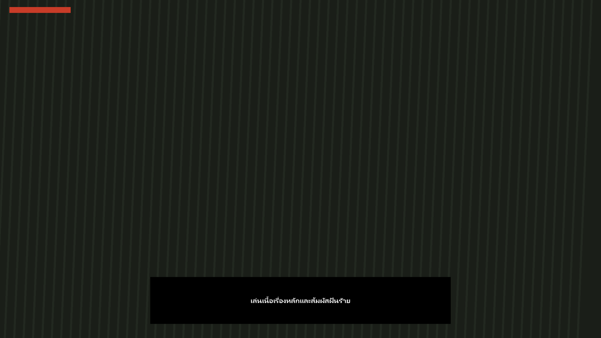
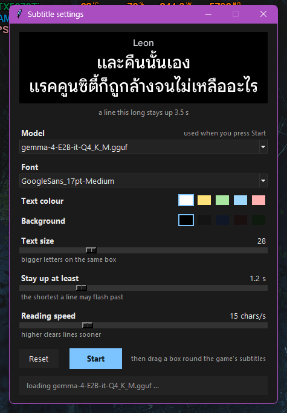
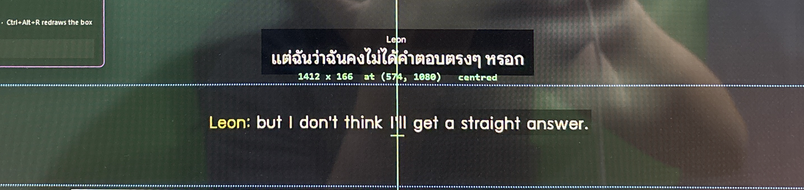

# local-game-subs — ซับไทยบนเกม แปลในเครื่องคุณเอง

อ่านซับของเกมจากหน้าจอคุณด้วยโมเดลภาพตัวเล็กที่รันในเครื่อง แล้วเอาคำแปลไปวางทับบนจอ
**เครื่องเดียวจบ ไม่มีอะไรถูกอัปโหลด ไม่มีอะไรถูกเก็บไว้**

ใช้กับเกมไหนก็ได้ที่มีซับ เพราะมันอ่าน**พิกเซล** ไม่ได้ไปยุ่งกับตัวเกม — ไม่ inject ไม่อ่านหน่วยความจำ
ไม่ต้องม็อด เกมไม่รู้ด้วยซ้ำว่ามีโปรแกรมนี้อยู่

> 📄 English version: **[README.md](README.md)** · คู่มือพร้อมรูป: **[GUIDE.md](GUIDE.md)**



*กล่องดำมีขนาดเท่าประโยค วางบนกรอบที่คุณเล็งไว้เอง · ตอนไม่มีใครพูด บนจอไม่มีอะไรเลย*



*ทุกอย่างที่ต้องเลือกอยู่หน้าเดียว และเปิดทิ้งไว้ระหว่างเล่นได้ — ทุกปุ่มมีผลกับซับทันที*



*Resident Evil 4 ตอนติ๊ก **Show in OBS and recordings**: คำแปลอยู่เหนือกรอบ ส่วนบรรทัดของเกม
อยู่ในกรอบ · ถ่ายด้วยกล้องจากหน้าจอจริง เพราะมันถ่ายด้วยวิธีอื่นไม่ได้ — อ่านเหตุผลด้านล่าง*

> 📷 **ทำไมไม่มีรูปตอนมันทับเกมจริง:** กล่องซับ**ซ่อนตัวจากการแคปหน้าจอโดยตั้งใจ** เพราะมันนั่งอยู่ใน
> แถบที่โปรแกรมกำลังอ่าน ถ้าไม่ซ่อน คำแปลของตัวเองจะถูกอ่านเป็นซับใหม่แล้วแปลซ้ำวนไป ·
> Print Screen, OBS และปุ่มแคปของ Steam จะเห็นแต่เกม · **กล้องมือถือถ่ายเห็นปกติ** ·
> ถ้าจะสตรีมให้ใส่ `--in-capture` แล้วลากกล่องซับออกไปนอกกรอบ

---

## ต้องมีอะไรบ้าง

| | |
|---|---|
| **การ์ดจอ** | VRAM ว่างราว 6 GB (วัดจริงตอนใช้งาน รวมโมเดล + ตัวอ่านภาพ + context 8k = **4.85 GB**) |
| **พื้นที่ดิสก์** | ประมาณ 6.5 GB **อยู่ในโฟลเดอร์ของโปรแกรมเองทั้งหมด** |
| **ระบบปฏิบัติการ** | Windows (เพราะกล่องซับต้องคลิกทะลุได้) ส่วนตัวอ่านจอกับตัวแปลใช้ได้ทุกระบบ |
| **Python** | 3.8 ขึ้นไป |

🛑 **ต้องติดตั้ง Python เองก่อน** และตอนติดตั้ง **ต้องติ๊ก `Add Python to PATH`** ด้วย
ไม่งั้น `setup.bat` จะบอกว่าหาไม่เจอ → [python.org/downloads](https://www.python.org/downloads/)

---

## เริ่มใช้ — ดับเบิลคลิก `play.bat`

1. กด **Code → Download ZIP** ด้านบนของหน้านี้ แล้วแตกไฟล์
2. ดับเบิลคลิก **`play.bat`**

**ครั้งแรกครั้งเดียว** มันจะบอกว่าต้องโหลดอะไรบ้างแล้วรอให้คุณกด Enter ยืนยัน:

```
  This is the first run, so there are two things to fetch before anything can start:

    llama.cpp   the program that runs the model             about 34 MB
    the model   what reads your screen and translates       about 5.9 GB

  Press ENTER to fetch them now, or type N and press ENTER to cancel:
```

กด **Enter** → โหลดเสร็จแล้วมันเริ่มให้เลย · **ครั้งต่อ ๆ ไปกดแล้วเริ่มทันที ไม่ถามอีก**

⏳ ขั้นโหลด 6 GB นานที่สุด · **หยุดกลางคันได้ เปิดใหม่มันโหลดต่อจากเดิม**

✅ **ทุกอย่างอยู่ในโฟลเดอร์นั้นโฟลเดอร์เดียว** — ไม่แตะ registry ไม่แตะ Python ของเครื่องคุณ
ไม่เขียนอะไรลง home folder · **ถอนการติดตั้ง = ลบโฟลเดอร์ทิ้ง**

> `setup.bat` ยังอยู่ ถ้าอยากโหลดล่วงหน้าแยกจากการเล่น — แต่ไม่จำเป็นแล้ว

---

## หน้าต่างตั้งค่า

จะมี**หน้าต่างตั้งค่า**เปิดขึ้นมา ทุกอย่างที่ต้องเลือกอยู่บนนั้นหน้าเดียว แล้ว **ยังไม่มีอะไรเกิดขึ้นจนกว่าจะกด Start**

| ช่อง | ทำอะไร |
|---|---|
| **Model** | โมเดลที่ใช้อ่านหน้าจอ · ถ้ามีตัวเดียวไม่ต้องแตะ |
| **Translate into** | **พิมพ์ภาษาที่อยากได้เอง** — `Thai`, `Vietnamese`, `Catalan` อะไรก็ได้ |
| **Font** | ฟอนต์ทุกตัวในเครื่องที่วาดภาษานั้นได้จริง (คัดมาให้แล้ว) + ที่คุณลากใส่โฟลเดอร์ `fonts` |
| **Text colour / Background** | สีตัวอักษรกับสีพื้น · ขาวบนดำคือค่าเริ่มต้นเพราะเกมใช้แบบนี้ |
| **Text size** | ขนาดตัวอักษร |
| **Stay up at least** | บรรทัดหนึ่งอยู่บนจออย่างน้อยกี่วินาที |
| **Reading speed** | บรรทัดยาวได้เวลาเพิ่มมากแค่ไหน |

กด **Start** → โมเดลเริ่มโหลดไปพร้อมกับที่คุณเล็งกรอบ (แถบล่างของหน้าต่างบอกว่าถึงขั้นไหนแล้ว)

**เปิดหน้าต่างนี้ทิ้งไว้ระหว่างเล่นได้เลย** — ทุกปุ่มมีผลกับซับทันที เพราะเรื่องแบบนี้ตัดสินด้วยการมองไม่ได้
ถ้าไม่ได้เห็นของจริงอยู่ตรงหน้า

---

## เล็งกรอบ

พอกด Start จอจะหรี่ลงและมี**กรอบวางไว้ให้แล้ว** ตรงกลางค่อนล่าง ซึ่งเป็นที่ที่เกมส่วนใหญ่วางซับ
**ถ้ามันทับซับพอดีอยู่แล้ว กด `Enter` จบเลย**

| ทำแบบนี้ | ได้แบบนี้ |
|---|---|
| **ลากนอกกรอบ** | วาดกรอบใหม่ |
| **ลากในกรอบ** | ย้ายกรอบ ขนาดเท่าเดิม |
| **ปุ่มลูกศร** | ขยับทีละ 1 จุด · กด `Shift` ค้าง = ทีละ 10 |
| **กด `C`** | เด้งเข้ากลางจอ |
| **`Enter`** หรือกดปุ่มบนจอ | ใช้กรอบนี้ |
| **`Esc`** | ใช้กรอบเดิม |

เส้นประกลางจอคือแนวกึ่งกลาง · พอกรอบตรงกลางจริง (ใกล้พอมันจะดูดให้เอง) เส้น กากบาท และตัวเลข
**จะเปลี่ยนเป็นสีเขียวแล้วขึ้นคำว่า `centred`**

⚠️ **ทำกรอบให้สูงพอสำหรับซับ 2 บรรทัด** — กรอบที่พอดีซับบรรทัดเดียวจะขาดไปหนึ่งบรรทัดทันทีที่เกมขึ้นสองบรรทัด
แล้วโมเดลจะได้รับประโยคแค่ครึ่งเดียว **แล้วมันจะแปลครึ่งนั้นได้อย่างสมบูรณ์แบบ** ซึ่งคือความพังที่มองไม่ออก
· กรอบเริ่มต้นสูงพออยู่แล้ว · ถ้าข้อความชนขอบ คอนโซลจะเตือน

เล็งใหม่ได้ตลอดโดยไม่ต้องปิดโปรแกรม: ปุ่ม **Move box** ในหน้าต่างตั้งค่า หรือ **`Ctrl+Alt+R`**
— เกมเปลี่ยนที่วางซับระหว่างเมนูกับคัตซีนอยู่แล้ว

---

## ตอนใช้งานจริง

ซับจะขึ้นบนกรอบที่คุณเล็งไว้เอง · **คลิกทะลุไปที่เกมได้ตามปกติ** · **ตอนไม่มีใครพูด บนจอไม่มีอะไรเลย**
ไม่มีกรอบ ไม่มีกล่องดำรออยู่

| ปุ่ม | ทำอะไร |
|---|---|
| **Move box** / `Ctrl+Alt+R` | เล็งกรอบใหม่ ไม่ต้องรีสตาร์ต |
| `Ctrl+Alt+Q` | ปิดกล่องซับ |
| `Ctrl+Alt+L` | ปลดล็อกกล่องซับ ถ้าอยากลากไปวางที่อื่น (ปกติไม่ต้องใช้) |
| `Ctrl+C` ในหน้าต่างดำ | หยุดทั้งหมด |

---

## เรื่องที่ควรรู้ก่อนใช้

**⏱️ ประมาณ 0.7–1 วินาทีต่อบรรทัด** (วัดบน RTX 5070 Ti กับโมเดล E2B) — ซับจะตามหลังเสียงนิดหน่อย
เป็นเรื่องปกติของการอ่านจากหน้าจอ

**📖 บรรทัดหนึ่งจะอยู่บนจออย่างน้อย 1.2 วินาที** ยาวกว่านั้นถ้าประโยคยาว เพราะกว่าโมเดลจะตอบ
เกมมักเปลี่ยนบรรทัดไปแล้ว ถ้าไม่มีเวลาขั้นต่ำ คำแปลจะโผล่แล้วหายในเสี้ยววินาที — **ขึ้นจริง ถูกต้อง แต่อ่านไม่ทัน**

**🔁 ประโยคเดิมจะได้คำแปลเดิมเสมอ** เพราะโมเดลสุ่มคำตอบ อ่านสองครั้งได้สำนวนต่างกันนิดหน่อย
ถ้าไม่จำไว้ ตัวหนังสือบนจอจะเปลี่ยนไปมาเองทั้งที่ภาษาอังกฤษข้างหลังไม่ได้ขยับ

**🗣️ สรรพนามใช้ `ฉัน` กับ `คุณ` เท่านั้น** — ซับไม่ได้บอกว่าคนพูดเป็นผู้ชายผู้หญิง อายุเท่าไหร่
หรือสนิทกันแค่ไหน แต่สรรพนามไทยทุกตัวมันบอกหมด · ส่วน he / she / it ชัดเจนอยู่แล้วในภาษาอังกฤษ แปลตามปกติ

**🎯 มันแปลทุกอย่างที่อยู่ในกรอบ** — กรอบคือคำตอบว่าอยากให้แปลอะไร ถ้าเมนูหรือหน้าต่างอื่นบังเข้ามาในกรอบ
มันก็จะแปลอันนั้นด้วย

**⚙️ วัดจริงแค่ภาษาไทย** — ภาษาอื่นเรารับประกันได้แค่ว่าฟอนต์ถูกคัดถูกต้องและโมเดลถูกสั่งถูก
ไม่ได้แปลว่าคุณภาพคำแปลถูกตรวจแล้ว

---

## อัดคลิป / สตรีม

ปกติ**กล่องซับซ่อนตัวจากการแคปหน้าจอ** — OBS, Print Screen, ปุ่มแคปของ Steam จะเห็นแต่เกม
ไม่ใช่บั๊ก แต่จำเป็น: กล่องซับนั่งอยู่ในแถบที่โปรแกรมกำลังอ่าน ถ้ามันเห็นตัวเอง คำแปลจะถูกอ่าน
เป็นซับใหม่แล้วแปลซ้ำวนไปเรื่อย ๆ

**ติ๊ก `Show in OBS and recordings` ในหน้าต่างตั้งค่า** — ติ๊กแล้วเห็นผลทันที ไม่ต้องรีสตาร์ต
แม้ OBS จะเปิดอยู่

สวิตช์เดียวทำสองอย่างพร้อมกัน เพราะ**แยกกันแล้วพัง**:

1. เลิกซ่อนตัวจากการแคป ⇒ OBS เห็น
2. **ย้ายกล่องซับขึ้นไปเหนือกรอบ** ⇒ ไม่อยู่ในแถบที่ตัวเองอ่าน ⇒ ไม่วนลูป

ทำข้อ 1 อย่างเดียว = ซับวนแปลตัวเอง · ทำข้อ 2 อย่างเดียว = OBS ยังไม่เห็นอยู่ดี

ตำแหน่งใหม่จะอยู่**กึ่งกลางแนวเดียวกับกรอบ แค่สูงขึ้นไป** — ถ้ากรอบอยู่ติดขอบบนจอจนไม่มีที่ว่าง
มันจะไม่ยอมหลุดออกนอกจอ

> ยังใช้ `play.bat --in-capture` แบบเดิมได้ ถ้าชอบพิมพ์คำสั่ง — แฟล็กนั้นชนะสวิตช์เสมอ

---

## เจอปัญหา

| อาการ | ทำยังไง |
|---|---|
| **ครั้งแรกมันขอโหลด 6 GB** | ปกติ — กด Enter แล้วรอ · ครั้งต่อไปไม่ถามอีก |
| **ไม่มีอะไรขึ้นเลย** | เปิด `http://127.0.0.1:8914/snap` ในเบราว์เซอร์ จะเห็นภาพที่โมเดลกำลังอ่านอยู่จริง ถ้าไม่มีตัวหนังสือในนั้น = กรอบเล็งผิดที่ |
| **ตัวหนังสือไทยวรรณยุกต์ลอยผิดที่** | เปลี่ยนฟอนต์ในหน้าต่างตั้งค่า — ฟอนต์บางตัวซ้อนสระกับวรรณยุกต์ไม่ได้ |
| **แคปหน้าจอ / OBS แล้วไม่เห็นซับ** | ตั้งใจให้เป็นแบบนั้น — ติ๊ก **Show in OBS and recordings** ในหน้าต่างตั้งค่า (ดูหัวข้อ *อัดคลิป / สตรีม* ด้านล่าง) |
| **ช้าเกินไป** | ลองโมเดลตัวเล็ก: `python -m gamesubs models` แล้ว `setup --model-name e2b` |

รายละเอียดเต็มพร้อมรูป: **[GUIDE.md](GUIDE.md)**

---

## ติดต่อ

**เจอบั๊ก มีคำถาม หรือมีไอเดีย** — เปิด issue ในหน้า repo นี้ เร็วที่สุดและคนถัดไปที่เจอปัญหาเดียวกัน
จะได้เห็นคำตอบด้วย

**ติดต่องาน** — ashiran.awork@gmail.com

---

## สัญญาอนุญาต

MIT — เอาไปใช้ เอาไปแก้ เอาไปขายได้ ขอแค่ติดข้อความลิขสิทธิ์ไปด้วย
